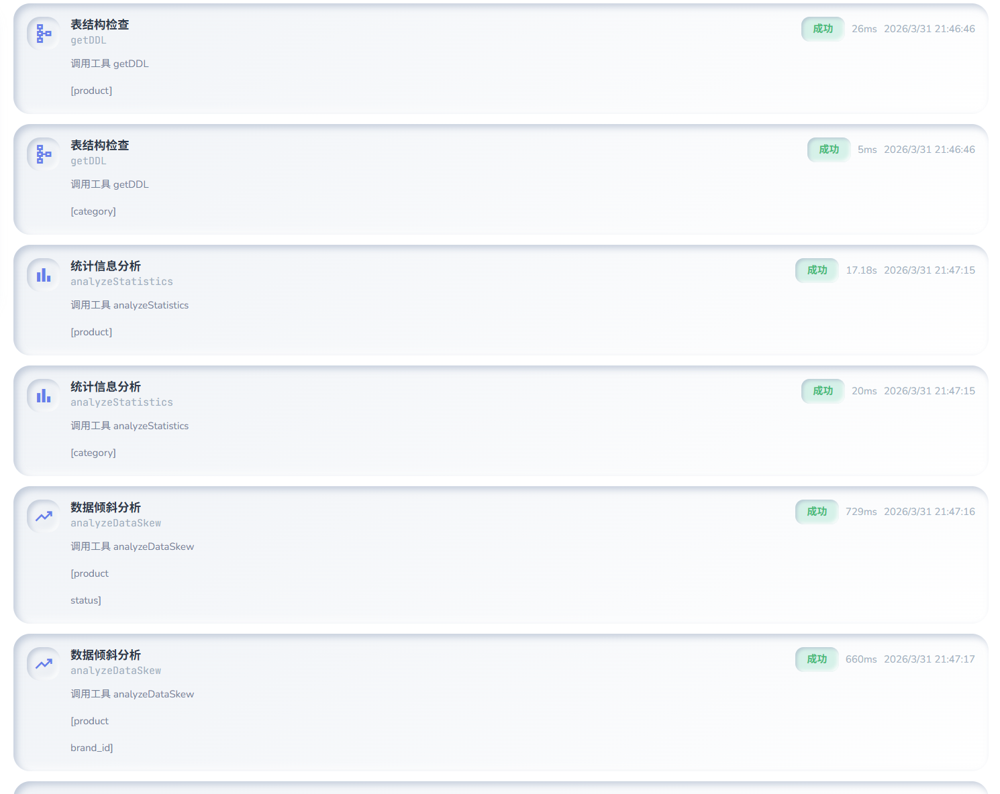
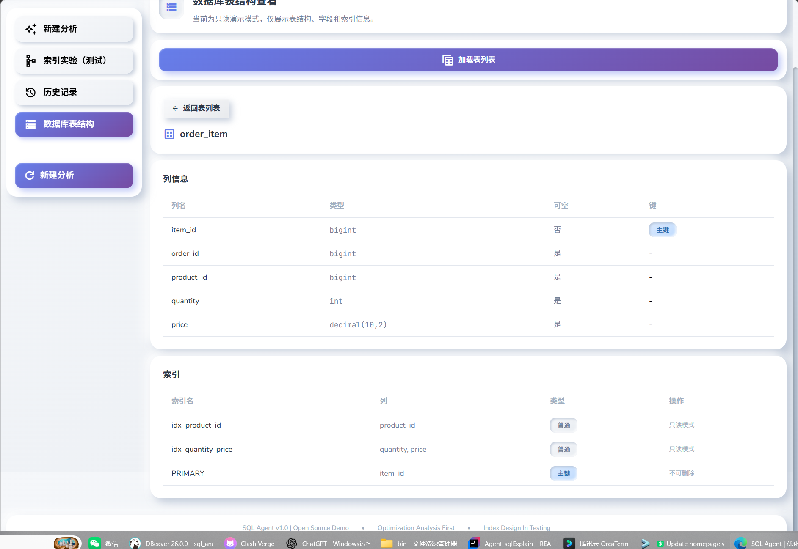
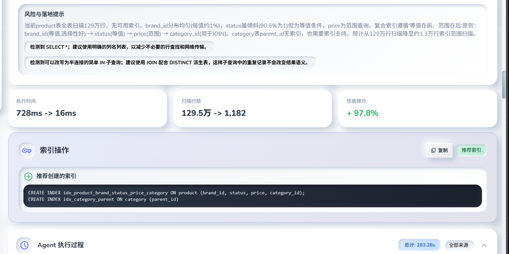

# SQL Agent

[](https://opensource.org/licenses/MIT)
[](https://openjdk.org/projects/jdk/17/)
[](https://spring.io/projects/spring-boot)
[](https://docs.langchain4j.dev)

[English README](README.md) | [贡献指南](CONTRIBUTING.zh-CN.md) | [安全策略](SECURITY.md)

这是一个面向 MySQL 场景的开源 SQL 优化 Agent 项目，基于 `Spring Boot`、`LangChain4j` 与 `OpenAI 通用接口` 构建。

现在把项目拆成两个方向来推进，但成熟度并不相同：

- `优化分析` 是当前最核心、也最适合对外展示的能力。
- `单表多索引设计` 还在测试和演进阶段。

## 项目定位

做这个项目，不是想再做一个只会“给建议”的 SQL 聊天机器人，而是想把模型建议尽量落到“可验证结果”上。

现在主要盯三件事：

- 证据优先：先看 `EXPLAIN`、表结构、统计信息、执行轨迹，再给优化结论。
- 系统验证：模型负责提出候选方案，系统负责执行、校验和评分。
- 开源安全：默认以只读演示模式运行，不直接暴露真实索引变更能力。

## [在线体验](https://guohaolong.top/SQLAgent)


## 界面截图

### SQL 优化分析流程



- 输入 SQL 查询并获得 AI 驱动的优化建议
- 实时流式展示执行进度
- 优化前后的 EXPLAIN 计划对比
- 候选方案工作台及性能指标

### 数据库表结构浏览器



- 浏览数据库中的所有表
- 查看表结构和现有索引
- 分析统计信息和数据分布

### 实验性索引设计



- 多 SQL 工作负载分析
- 索引覆盖率和推荐理由
- 索引优化的 DDL 建议

---

## 当前重点功能

### 1. 优化分析

这是目前打磨得最完整、也最适合先体验的主流程。

在这条链路里，我会：

- 接收一条 `SELECT` / `WITH` 查询
- 让模型生成 1 到 5 个候选优化方案
- 测量基线性能
- 在系统侧验证 SQL 改写或临时索引方案
- 对优化前后结果做一致性校验
- 根据性能、执行计划、正确性和复杂度评分
- 选择最优方案并在前端展示证据链

核心文件：

- [OptimizationController.java](src/main/java/com/sqlagent/controller/OptimizationController.java)
- [UnifiedOptimizationService.java](src/main/java/com/sqlagent/service/UnifiedOptimizationService.java)
- [PlanGenerator.java](src/main/java/com/sqlagent/generator/PlanGenerator.java)
- [PlanExecutionEngine.java](src/main/java/com/sqlagent/engine/PlanExecutionEngine.java)
- [PlanEvaluator.java](src/main/java/com/sqlagent/evaluator/PlanEvaluator.java)

### 2. 单表多索引设计（测试阶段）

当前仓库里的 `/api/analyze/workload`，是为“单表多索引设计”搭的实验性基础能力。

现在已经做了这些：

- 多条 SQL 输入
- 候选索引集合建议
- 覆盖率、覆盖 SQL、DDL 建议、推荐理由展示
- 前端实验页

但它还不是最终形态，主要因为：

- 还没有像“优化分析”那样形成完整的系统侧验证闭环
- 还在收敛问题定义，目标是把“Workload 优化”继续收敛成“单表多索引设计助手”
- 这一页目前更适合拿来测试、验证思路和说明“还在继续打磨”，不适合包装成完全成熟能力

相关文件：

- [WorkloadController.java](src/main/java/com/sqlagent/controller/WorkloadController.java)
- [WorkloadOptimizationService.java](src/main/java/com/sqlagent/service/WorkloadOptimizationService.java)
- [IndexRecommendationEngine.java](src/main/java/com/sqlagent/tools/IndexRecommendationEngine.java)

## 功能概览

### 主功能

- 单 SQL 优化分析
- 流式执行过程展示
- 优化前后 Explain 对比
- 候选方案工作台
- 基线测量与结果一致性校验
- 历史记录回放

### 支撑能力

- SQL 输入校验
- 表结构和索引浏览
- 统计信息分析
- 数据倾斜分析
- 临时索引沙箱执行

### 实验能力

- 分组 SQL 的索引推荐
- 面向未来单表多索引设计能力的原型基础

## 架构概览

```text
Browser UI
  -> REST / SSE Controller
  -> Optimization Service
  -> Agent / Tools
  -> Execution Engine / Sandbox / Evaluator
  -> MySQL
```

主要模块：

- `controller`：接口入口与流式响应
- `service`：编排、历史、执行轨迹、结果组装
- `agent`：LangChain4j Agent 接口
- `tools`：Explain、DDL、Execute、Compare、Statistics、Covering Index、Data Skew、Index Recommendation
- `engine`：候选方案执行引擎
- `sandbox`：临时索引生命周期管理
- `evaluator`：候选方案评分与选择
- `static`：前端页面与组件

## 默认安全策略

在开源版本里默认按演示模式来收口，不直接开放真实变更能力。

默认运行参数：

- `SQL_AGENT_DEMO_READ_ONLY=true`
- `SQL_AGENT_MUTATION_ENABLED=false`

当变更能力关闭时：

- `/api/apply-optimization` 不允许真实创建索引
- `/api/index/drop` 不允许真实删除索引
- 前端会隐藏或禁用对应操作

运行时特性接口：

- `GET /api/features`

## 快速开始

### 方式一：Docker Compose

1. 复制环境变量模板

```bash
cp .env.example .env
```

2. 编辑 `.env`，至少填写：

- `SQL_AGENT_DB_URL`
- `SQL_AGENT_DB_USERNAME`
- `SQL_AGENT_DB_PASSWORD`
- `SQL_AGENT_MODEL_BASE_URL`
- `SQL_AGENT_MODEL_API_KEY`
- `SQL_AGENT_MODEL`

3. 启动：

```bash
docker compose up --build
```

4. 访问：

```text
http://localhost:8899
```

说明：

- MySQL 启动时会自动加载 [schema.sql](src/main/resources/schema.sql)
- 如果你只是做开源演示，请保持只读模式默认值不变

### 方式二：本地 MySQL + Maven

1. 复制环境变量模板

```bash
cp .env.example .env
```

2. 准备 MySQL，并导入 [schema.sql](src/main/resources/schema.sql)

3. 将 `.env` 中的变量导入当前 shell

4. 启动应用

```bash
mvn spring-boot:run
```

## 环境变量

核心变量：

- `SQL_AGENT_DB_URL`
- `SQL_AGENT_DB_USERNAME`
- `SQL_AGENT_DB_PASSWORD`
- `SQL_AGENT_MODEL_BASE_URL`
- `SQL_AGENT_MODEL_API_KEY`
- `SQL_AGENT_MODEL`
- `SQL_AGENT_AVAILABLE_MODELS`
- `SQL_AGENT_DEMO_READ_ONLY`
- `SQL_AGENT_MUTATION_ENABLED`

完整示例见 [.env.example](.env.example)。

## 模型接入方式

我这里采用的是 `OpenAI 通用接口` 约定。

也就是说，只要你的模型服务兼容 OpenAI 风格的 Chat Completions 参数，就可以接入，例如：

- OpenAI 官方接口
- 自建代理网关
- 提供 OpenAI-compatible 接口的第三方服务

## API 概览

### 主优化流程

- `POST /api/optimize`
- `POST /api/optimize/stream`

### 实验性索引流程

- `POST /api/analyze/workload`

### 元数据与辅助接口

- `GET /api/models`
- `GET /api/tools`
- `GET /api/optimization-samples`
- `GET /api/features`
- `POST /api/sql/validate`
- `GET /api/health`
- `GET /api/tables`
- `GET /api/table/{tableName}/detail`

### 历史记录

- `GET /api/history/list`
- `GET /api/history/{id}`
- `DELETE /api/history/{id}`

## 前端定位

前端现在会直接反映各条功能链路的成熟度判断：

- `优化分析` 是主入口
- 索引相关实验页会明确标记为测试阶段 / 实验入口
- 表结构页默认保持只读演示定位

主要前端文件：

- [index.html](src/main/resources/static/index.html)
- [analyze.js](src/main/resources/static/js/pages/analyze.js)
- [workload.js](src/main/resources/static/js/pages/workload.js)
- [stream.js](src/main/resources/static/js/services/stream.js)
- [results.js](src/main/resources/static/js/components/results.js)

## 测试

现在的自动化测试主要覆盖：

- SQL 模式识别
- SQL 输入校验
- 历史结果反序列化兼容性
- 候选方案评分选择

运行方式：

```bash
mvn test
```

## 后续路线

### 近期

- 继续优化开源使用体验
- 增加更多集成测试
- 补齐更完整的演示数据与 benchmark case
- 进一步完善部署说明

### 下一阶段重点

- 把实验性索引流程继续收敛成真正的“单表多索引设计助手”
- 支持索引集合的保留 / 新增 / 退役决策
- 为索引设计链路补齐更强的系统侧验证

## 已知限制

- 实验性索引流程目前还不如“优化分析”链路严谨
- 部分索引推荐逻辑仍在持续迭代
- 前端仍依赖外部 CDN 与字体资源

## 贡献

见 [CONTRIBUTING.zh-CN.md](CONTRIBUTING.zh-CN.md)

## 许可证

MIT，见 [LICENSE](LICENSE)
